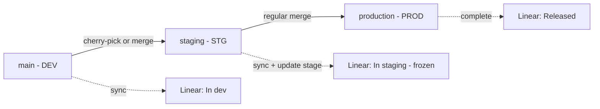

# Release process: main → staging → production

> Pattern adapted from Gigaverse's [Linear Release process doc](https://linear.app/gigaverse/document/linear-release-process-main-staging-production-b411d31239e4), simplified to a single repo + single pipeline.
>
> See also [ADR-0008](../adr/ADR-0008-linear-release-pipeline.md) for why this is set up the way it is.

## What this is

A single Linear release pipeline (`Forge Web`) tracking every issue's release status — `In dev`, `In staging`, `Released` — without manual stage moves. Driven by GitHub Actions on branch pushes.

## Pipeline & branches

| Branch | Environment | Linear stage |
| --- | --- | --- |
| `main` | DEV (Cloudflare Pages preview) | `In dev` |
| `staging` | STG (Cloudflare Pages staging) | `In staging` (frozen) |
| `production` | PROD (Cloudflare Pages production) | `Released` |

Solid arrows are git operations done by hand. Dotted arrows are automatic — `linear-release.yml` runs them on every push.

## Stage transitions

| Stage | Set when |
| --- | --- |
| `In dev` | A PR lands on `main` |
| `In staging` | Changes are promoted to `staging` |
| `Released` | `staging` is merged into `production` and deployed |

Once a release reaches `In staging`, the stage is **frozen**. New commits on `main` after that point start a fresh release in `In dev`. The QA window keeps a stable set of changes; parallel feature work doesn't sneak into the release that's about to ship.

## Promoting changes

### main → staging

Two ways, both supported:

- **Cherry-pick selected commits** when `main` has a mix and only some are ready.
- **Full merge from `main`** when everything currently on `main` should ship.

Linear treats both the same — `linear-release sync` reads the `(#NNNN)` PR ref in commit messages, which both methods preserve.

### staging → production

Use a **regular merge** (non-squash). Squashing rewrites SHA history, which breaks the matching that `linear-release complete` uses to mark the right release as `Released`.

## How Linear connects commits to issues

1. **Branch name** of the merged PR — `feat/frg-1234-feature-name` is enough.
2. **PR description** — `Closes FRG-1234`, `Fixes FRG-1234`, `Refs FRG-5678`.
3. **PR title** containing `FRG-1234`.

In day-to-day work, branch naming alone covers it. The `## Linear` section of the PR template is a backup.

## Naming convention

Linear assigns auto-numbered names (`Release 1`, `Release 2`...). We override those with the current cycle number for consistency.

| Type | Name format | Example |
| --- | --- | --- |
| Regular release | `Release N` (N = current cycle) | `Release 12` |
| Hotfix | `Release N - Hotfixes M` | `Release 12 - Hotfixes 1` |

After a release is cut (push to `staging`), rename it in Linear UI from the auto-generated `Release N` to `Release {current_cycle_number}`.

## Setup checklist

1. **Linear pipeline:** Settings → Releases → New pipeline → name `Forge Web`. Stages: keep `Started` and `Released` as system stages; create custom `In dev` and `In staging` (with these exact strings — `linear-release.yml` matches against them).
2. **Pipeline access key:** generate in Linear, add to repo secrets as `LINEAR_ACCESS_KEY`.
3. **GitHub Actions:** uncomment the steps in `.github/workflows/linear-release.yml`.
4. **Branch protection** on `main`, `staging`, `production`:
   - Require PR before merging
   - Require status checks (CI) to pass
   - Require conversation resolution
   - Restrict force pushes
   - On `staging` and `production`: require regular (non-squash) merges (see hard rule above).

## Edge cases

- **Hotfix written directly on `staging`:** Linear picks up the issue ref from the commit message. Cherry-pick the hotfix back to `main` afterwards or the next release will reintroduce the bug.
- **Frozen stage skips syncs:** any commit on `main` while a release is `In staging` goes to the next release. To add an issue to the frozen release, promote it to `staging`, don't reassign manually in Linear.
- **Re-running on the same push is safe:** `sync` is idempotent and `complete` on an already-completed release is a no-op.
- **Manual fallback:** the workflow has `workflow_dispatch` for ad-hoc `sync`/`update`/`complete` calls.

## Verifying it works

After merging a PR with `Closes FRG-XXXX`:

1. Wait for the **Linear Release** workflow on the `main` push to finish.
2. Open the issue in Linear → the **Release** field should show the current `In dev` release.
3. Promote to `staging` — issue moves to `In staging`.
4. Merge `staging → production` (regular merge) — issue moves to `Released`.

If the issue doesn't show up:

- Check the commit message kept the PR number in `(#NNNN)` form.
- Check the PR was linked via branch name, magic word, or title.
- Check `LINEAR_ACCESS_KEY` matches the pipeline.

## References

- Gigaverse [Linear Release process doc](https://linear.app/gigaverse/document/linear-release-process-main-staging-production-b411d31239e4)
- [Linear Release docs](https://linear.app/docs/releases)
- [`linear-release` CLI / GitHub Action](https://github.com/linear/linear-release)
- [Linear's GitHub integration docs](https://linear.app/docs/github)
- [ADR-0008](../adr/ADR-0008-linear-release-pipeline.md) — why we chose this pattern
