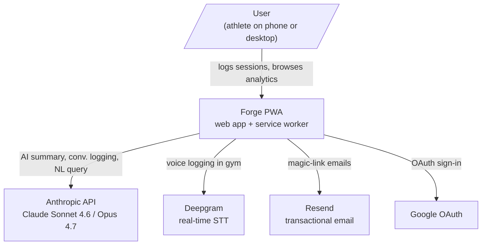
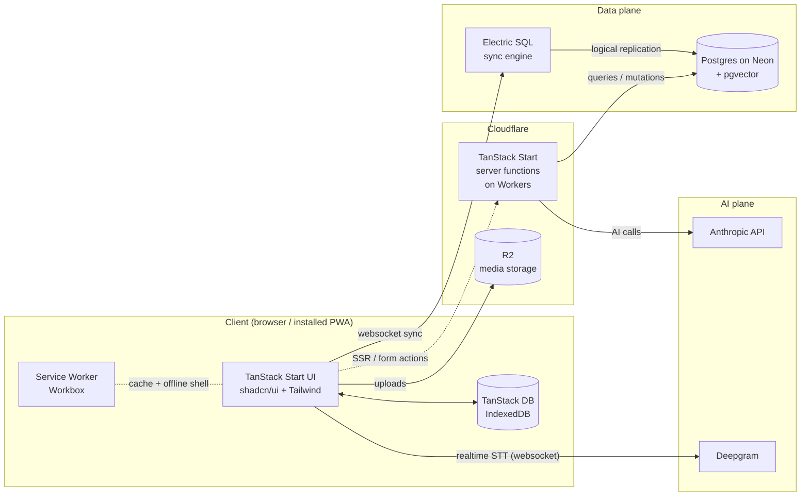

# System overview

> Living document. Updated as the system evolves.
>
> **Scope (post-audit 2026-05-16):** Forge is a **Hyrox athlete journal** with rehab tracking, daily wellness metrics (Sleep/HRV/HR Rest), AI-driven weekly summaries, and athlete↔coach sharing (P1+). Multi-tenant schema from day 1 (single-user UI in P0). For the data model see [data-model.md](data-model.md); for the re-framed scope rationale see [ADR-0009](../adr/ADR-0009-hyrox-data-model-rehab-tracking.md) and [ADR-0010](../adr/ADR-0010-multi-tenant-schema.md).

## Context (C4 level 1)

## Containers (C4 level 2)

## Key flows

### Logging a set offline

1. User taps a set in `SetInput` (mobile drawer).
2. UI writes to TanStack DB (IndexedDB) — UI updates instantly.
3. Service Worker queues the write if offline.
4. When connectivity returns, Electric syncs the change to Postgres.

### AI auto-summary after a session

1. User completes a session; the client triggers a server function.
2. Server function loads the session + history for the same exercises.
3. Server function calls Anthropic (Claude Opus 4.7 for heavier reasoning) with the history; uses prompt caching for repeated context.
4. The summary is written back to `workout_sessions.ai_summary` and surfaced in the UI.

### Conversational logging

1. User types or dictates: "siady 4×5 100kg, drugi set ciężko".
2. Client streams to a server function which calls Claude with tool definitions (`add_set`, `add_note`, `flag_pain`).
3. Tool calls validated with Zod; writes go through TanStack DB (optimistic) and sync via Electric.

## Source-of-truth pointers

- Schema: `db/schema.ts`
- Sync setup: `app/lib/db/electric.ts`
- AI prompts and tools: `app/lib/ai/`
- Routing: `app/routes/`
- Server functions: `app/server/`
- ADRs: [docs/adr/](../adr/)
